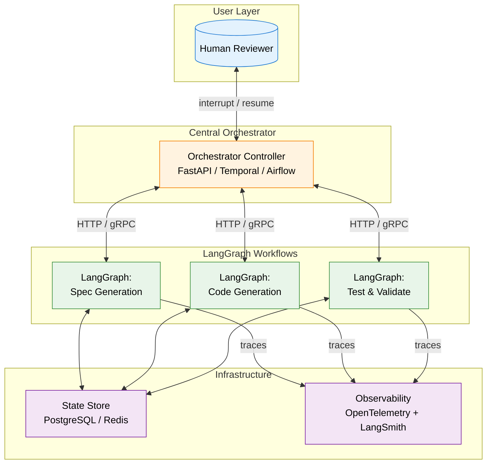
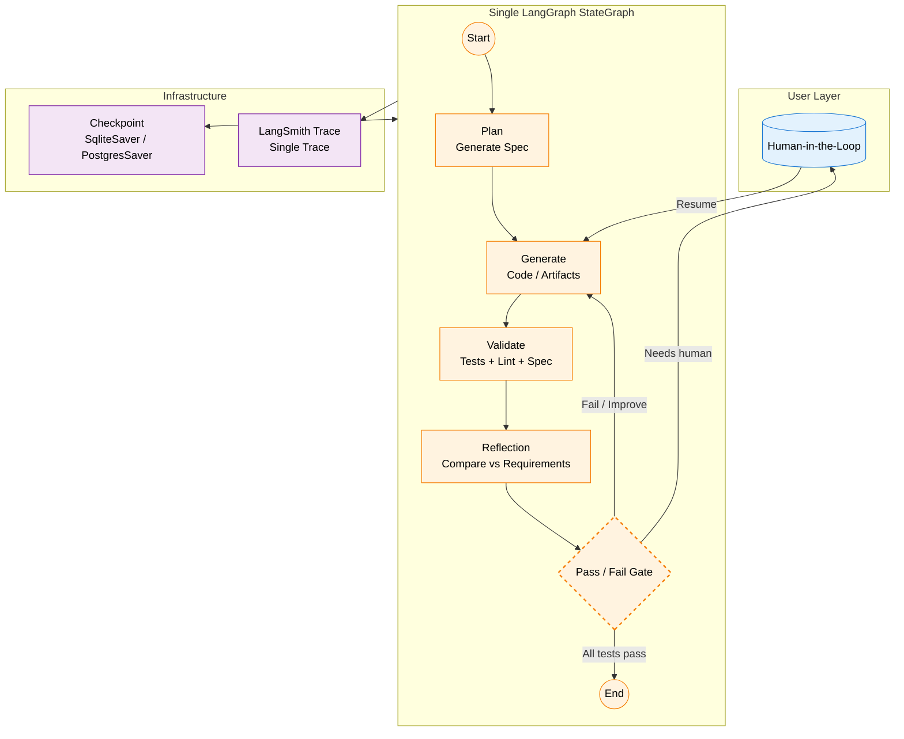
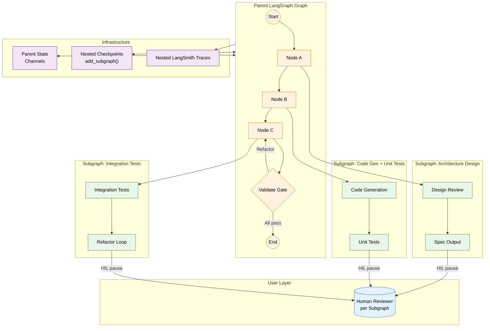

Building software with AI agents involves an iterative, feedback-driven looping process, instead of writing prompts manually. In my open-source project [`loop_engineering_factory`](https://github.com/terrygzhou/loop_engineering_factory), I’ve been developing an **AI agent-driven loop-engineering factories** that produce working software with minimal human intervention. 

The core requirement is clear: **each iteration must self-improve without writing a single prompt**, guided by **specification-driven-design** (_SDD_),  orchestration of **Agent skills**, structured feedback by agents, automated validation, and *minimal but necessary* human oversight (Human-in-the-Loop, or HIL). 

The architecture I choose to run these loops dramatically impacts reliability, flexibility, debuggability, and ultimately, product quality. After months of prototyping, I’ve distilled three dominant patterns for orchestrating LangGraph-based agent loops. Here’s how they compare, when to use each, and how to bake HIL and self-improvement into your design.

---

## 🔹 Pattern 1: Central Orchestration Layer Coordinates Multiple LangGraph Workflows

In this pattern, an external or parent orchestrator (e.g., FastAPI service, Airflow DAG, **Temporal** workflow, or custom Python controller) manages the lifecycle of several independent _children_ LangGraph graphs. The orchestrator routes tasks, persists state, triggers HIL checkpoints, and decides when to advance to the next iteration.

### How it works

| Aspect           | Implementation Detail                                                                                                                                                                                 |
| ---------------- | ----------------------------------------------------------------------------------------------------------------------------------------------------------------------------------------------------- |
| State Management | Orchestrator maintains a centralized state store (DB, Redis, or in-memory). Each LangGraph graph runs with its own isolated StateGraph. Context is serialised/passed via HTTP/gRPC or message queues. |
| HIL Integration  | Exposed as explicit API endpoints or workflow scheduler hooks (interrupt(), resume()). Humans interact via UI/dashboard that talks to the orchestrator, not directly to LangGraph.                    |
| Self-Improvement | Implemented in FEED node. Analyses test reports, lint output, and spec alignment. Injects structured prompts or patches back into the orchestrator for retry routing.                                 |
| Observability    | Requires distributed tracing (OpenTelemetry) + LangSmith per graph. Orchestrator must log handoff timestamps, payload sizes, and error codes.                                                         |

### ✅ Pros
-  **Independent pieces**: Each workflow can be built, updated, or replaced without breaking the rest.
- **Flexible tooling**: You can swap out AI frameworks or run tasks on different servers easily.
- **Clear human checkpoints**: The manager can naturally pause execution, ask for input, and resume.
### ❌ Cons
- **Manual context sharing**: Information must be passed between workflows, which can get messy.
- **Slower coordination**: Moving data back and forth adds delay and complexity.
- **Harder to debug**: Tracking what went wrong across separate systems requires extra logging and monitoring.

### 🎯 Best for
- Teams already using workflow schedulers or cloud orchestration tools.
- Projects where different steps run on different hardware or teams.

---

## 🔹 Pattern 2: LangGraph Itself as the Orchestration Layer

Here, a single LangGraph `StateGraph` acts as the central orchestrator. Sub-tasks are implemented as nodes, tools, or conditional branches. State flows natively through LangGraph’s typed state machine, and HIL/self-improvement loops are built directly into the graph.

### How it works

| Aspect           | Implementation Detail                                                                                                                                        |
|------------------|--------------------------------------------------------------------------------------------------------------------------------------------------------------|
| State Management | Native LangGraph TypedDict or Pydantic state. All nodes read/write the same state. Checkpointing uses SqliteSaver or PostgresSaver.                          |
| HIL Integration  | Built via graph.add_node("HIL", interrupt) + interrupt_before / interrupt_after. LangGraph’s interrupt() pauses execution and streams pending state to a UI. |
| Self-Improvement | Reflect node runs a lightweight LLM pass: compares output vs requirements, extracts failure traces, and injects targeted fixes or test cases back into Gen.  |
| Observability    | Single LangSmith trace. Every state mutation, tool call, and LLM response is captured. Ideal for rapid debugging and prompt iteration.                       |

### ✅ Pros
- **Shared context**: Everything runs in the same environment, so AI steps never lose track of earlier decisions.
- **Built-in human checkpoints**: Pausing for review or approval is straightforward and integrated.
- **Tight feedback**: Testing, reflection, and fixes happen in the same flow, making self-improvement natural.
- **Easy to trace**: You can see exactly what happened at each step, making troubleshooting much simpler.

### ❌ Cons
- **Can get bulky**: As you add steps, the single workflow can become hard to navigate without careful organisation.
- **Less independent scaling**: You can’t easily scale just one step without scaling the whole flow.

### 🎯 Best for
- Teams building AI-assisted coding or content pipelines from scratch.
- Projects where speed, shared context, and human checkpoints are top priorities.

---

## 🔹 Pattern 3: Hierarchical LangGraph Workflows (Graph-of-Graphs)

Each node in a top-level LangGraph graph is itself a fully independent LangGraph workflow. LangGraph supports this natively via subgraphs, or you can federate them as separate graph instances sharing a parent state context.

### How it works

| Aspect           | Implementation Detail                                                                                                                                                   |
|------------------|-------------------------------------------------------------------------------------------------------------------------------------------------------------------------|
| State Management | Parent state defines top-level channels. Children expose AddDict or operator.add reducers. Use StateGraph.add_subgraph() to bind child state to parent channels safely. |
| HIL Integration  | Each subgraph defines its own interrupt() node. Parent can pause a specific subgraph without blocking others. UI shows isolated diffs/test reports per phase.           |
| Self-Improvement | Isolated per subgraph. Subgraph A can loop 5x on architecture while B runs once. Reduces wasted LLM calls and improves compute efficiency.                              |
| Observability    | Nested LangSmith traces. Parent trace shows subgraph entry/exit. Use metadata tags to filter traces by phase, iteration, or human reviewer.                             |

### ✅ Pros
- **Modularity**: Each sub-loop can have its own HIL gates, validation harnesses, and reflection agents.
- **Independent iteration**: One subgraph can loop 5 times while another runs once, optimizing compute.
- **Reusability**: Subgraphs become composable building blocks across projects.

### ❌ Cons
- **State sync complexity**: Parent-child state propagation requires careful channel design (`AddDict`, `operator.add`, or custom reducers).
- **Debugging overhead**: Nested tracing can be verbose; LangSmith helps but requires structured logging.
- **Deployment complexity**: Federated graphs may need separate containerization or routing.

### 🎯 Best for
- Complex, multi-stage pipelines (e.g., `Design → Code → Test → Security Audit → Deploy`).
- Teams building reusable agent components that need isolated HIL and iteration loops.

---

## 📊 Pattern Comparison at a Glance

| Criteria                | Pattern 1: Central Orchestrator | Pattern 2: LangGraph as Orchestrator | Pattern 3: Hierarchical/Subgraphs |
|-------------------------|--------------------------------|--------------------------------------|----------------------------------|
| **State Consistency**   | Low (manual sync)             | High (native typed state)            | Medium (parent-child channels)   |
| **HIL Integration**     | Explicit API/gate             | Built-in `interrupt()` + checkpoint | Native per subgraph             |
| **Self-Improvement Loop**| External feedback injection  | Tight reflection/validate nodes     | Isolated per sub-loop           |
| **Debuggability**       | Hard (distributed tracing)    | High (LangSmith + state snapshots)  | Medium (nested traces)          |
| **Scaling Flexibility** | High (infra-agnostic)         | Medium (LangServe/Cloud-native)    | High (independent subgraphs)    |
| **Best Use Case**        | Legacy/integration pipelines | AI-native loop factories            | Complex, multi-stage pipelines  |

---

## 🛠️ Engineering Self-Improvement & HIL in LangGraph

Self-improvement doesn’t happen by accident. It’s built in through intentional design. Here’s how to make your loops actually get better over time:

### 1. Add Reflection Nodes
After each AI output, run a quick review pass that:
- Compares the result against the original requirements
- Spots missing pieces or common mistakes
- Suggests specific fixes (e.g., “Add input validation,” “Simplify this function,” “Write a test for edge case X”)

### 2. Set Clear Pass/Fail Gates

Don’t let the loop run forever. Define clear rules for when to move forward, when to improve, and when to pause:
- All tests pass + coverage meets threshold → Move to next stage
- Fails safety/lint checks → Loop back for fixes
- Complex edge case or policy question → Pause for human review

### 3. Native Human-in-the-Loop

Use your workflow tool’s pause-and-resume features to:
- Show humans a summary, diff, or test report before continuing
- Allow quick approvals, edits, or directive changes
- Resume exactly where you left off, with context preserved

### 4. Save Progress at every step
Record state after each loop so you can:

- Roll back if something goes off track
- Keep an audit trail for compliance or team reviews
- Jump back in days later without starting over

---

## 🧭 My practice: Start with Pattern 2, Evolve to Pattern 3

For most AI agent loop factories, **Pattern 2 (LangGraph as orchestrator)** provides the best balance of simplicity, state consistency, and native HIL support. It’s ideal for rapid prototyping and production-grade iteration loops.

As your system scales and sub-loops diverge in compute, validation, or human review requirements, **evolve to Pattern 3 (hierarchical subgraphs)**. This preserves modularity while keeping LangGraph’s routing and checkpointing intact.

Only use **Pattern 1 (External Manager)** if you’re tying into existing enterprise tools, need strict scheduling rules, or must run parts of your pipeline on completely separate infrastructure.

---

## 🔚 Final Thoughts

Building AI workflows that improve over time isn’t about crafting the perfect prompt. It’s about designing **flows that remember, reflect, validate, and know when to ask for help**. The right architecture turns chaotic trial-and-error into a predictable, auditable production line.

In [`loop_engineering_factory`](https://github.com/terrygzhou/loop_engineering_factory), I’m actively evolving from a single unified flow into nested, modular loops. The aim isn’t full autonomy—it’s **reliable, transparent, and continuously improving AI-assisted development**.
  
If you’re experimenting with agent loops, I’d love to see how you structure your checkpoints, feedback cycles, and human review steps. Drop a link in the comments or open a discussion on the repo.

---

*Want to dive deeper? Check out the LangGraph docs on [interrupts & HIL](https://langchain-ai.github.io/langgraph/concepts/human_in_the_loop/), [state management](https://langchain-ai.github.io/langgraph/concepts/low_level/#state), and [conditional edges](https://langchain-ai.github.io/langgraph/concepts/high_level/#conditional-nodes-and-edges).*