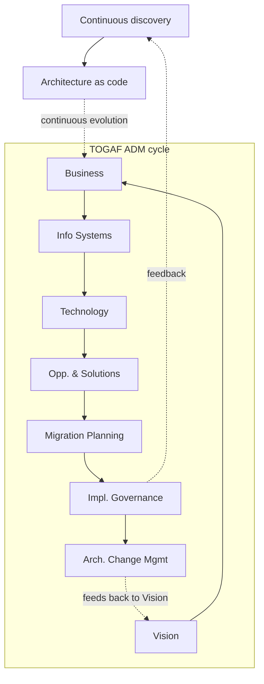
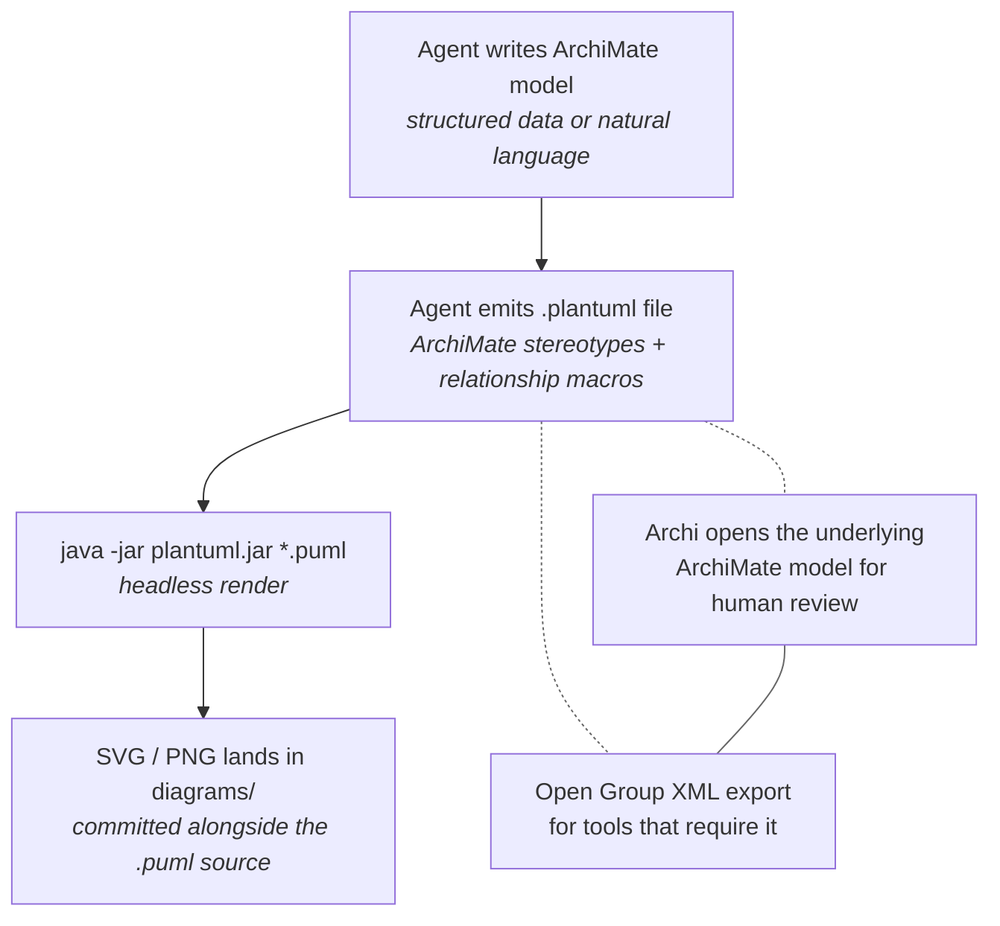

AI agents generate enterprise architecture content at a rate no diagram toolchain can keep up with. In [Agentic Executable EA](https://www.eywalink.org/resources/arckit-ea-whitepaper/), agents produce capability maps, application landscapes, data-flow diagrams, and transition waves across TOGAF ADM phases and Open Agile Architecture. The bottleneck was never the modeling language. It was to maintain the balance to serve two audiences -- humans and agents:  a human architect who needs to review, challenge, and present the result, and  an agent must parse the structured source to generate scaffolding and execution plans. 

I tested five headless diagram tools against one requirement: an agent emits text, and a standards-compliant diagrams come out the other side with human review. The answer comes down to one question — do the diagrams need to survive a compliance review so they can be implemented to code by agents?

---

## The requirement

This post shows the three diagram types an agent-driven EA pipeline actually emits, all rendered headless from `.puml` source in a single `java -jar` step. The examples come from a real case study — a 58-store automotive group's transformation across three migration waves.

An agent-driven diagram pipeline has three hard constraints:

1. **Text-in, diagram-out** — the agent writes a text description; the renderer produces the diagram. No GUI, no drag-and-drop, no browser.
2. **ArchiMate semantics** — the Open Group's ArchiMate spec defines element categories (Business, Application, Technology, Motivation, Strategy, Physical) and relationship types (Serving, Realization, Specialization, Composition, Association, Flow, Access, Aggregation, Influence, Triggering). The renderer must honor these, not just draw boxes.
3. **Headless, CI-friendly** — it must run in a Docker container, a GitHub Action, or a subagent terminal session. No Java display server, no Electron, no browser.

Most diagram tools fail one of these three. ArchiMate compliance is the one almost all of them fail.

---

## The audience has shifted

For decades, architecture diagrams were human artifacts: rendered for a slide, read by a person, interpreted in a review meeting. That is no longer the full picture. In agent-driven pipelines, the diagram's audience now includes implementation agents that parse the model to generate scaffolding, configure infrastructure, validate capability mappings, and emit migration waves. They do not look at a rendered PNG — they read the structured source.

This is why the choice of PlantUML ArchiMate is not just about headless rendering — it is about hitting the balance between two competing demands:

- **Accurate structure and semantics for AI agents** — the ArchiMate stereotypes, relationship macros, and layer color coding encode Open Group semantics that an LLM can read, reason over, and use as ground truth when generating downstream artifacts. The `.puml` source is not just text; it is a standards-constrained representation that carries the meaning of a business process, an application service, and a data store distinct from one another.
- **Faithful visualisation for humans** — the same source renders to SVG/PNG with correct ArchiMate shape sets, relationship glyphs, and layer colors, so a human architect can still review, challenge, and present the model without a separate visual toolchain.

Most diagram tools optimise for one audience or the other. Archi optimises for human visual modelling. Archify optimises for human presentation. PlantUML ArchiMate is the tool I found that serves both: the text is the primary artifact, the image is a projection of it, and neither audience is an afterthought.

---

## What I evaluated

| Tool               | Text-in/Text-out | ArchiMate semantics | Headless/CI | Verdict |
| ------------------ | :--------------: | :-----------------: | :---------: | ------- |
| Mermaid            |       Yes        |        None         |     Yes     | No      |
| D2                 |       Yes        |        None         |     Yes     | No      |
| Archi (Archi-mcp ) |       Yes        |         Yes         |   Partial   | No      |
| Archify            |       Yes        |       Minimal       |     Yes     | No      |
| PlantUML ArchiMate |       Yes        |         Yes         |     Yes     | **Yes** |

---

## [Mermaid](https://github.com/mermaid-js/mermaid)

Mermaid is the default for process maps, journey charts, and sequence diagrams in Obsidian. I use it daily for workflow paths and ADM state transitions.

What it lacks: ArchiMate has no place in its shape library. A "capability" and an "application component" render as the same box. There is no `<<business-process>>` stereotype, no ArchiMate relationship glyph, no layer color coding. You can approximate notation with labels and shapes, but the moment a standards-compliant output is required — a TOGAF Phase B capability model, for example — Mermaid is the wrong tool.

I use Mermaid where it's strong. ArchiMate is not that place.

---

## [D2](https://github.com/d2lang/d2)

[D2](https://github.com/d2lang/d2) is a text-to-diagram engine with clean syntax and an MCP server (`d2mcp`). I was initially recommended to pair it with `archimate-mcp` for headless ArchiMate rendering.

The problem: D2 is a generic graph layout engine. It has no ArchiMate shape set — no cylinders for data stores, no hexagons for capabilities, no ArchiMate relationship arrows. There is no D2 extension, shape library, or sprite set in the ecosystem that adds ArchiMate notation. You end up faking it with labels and custom shapes, which defeats the purpose of standards-compliant output.

D2 also had a practical rendering issue: `grid` layout renders a literal node labeled "grid" instead of applying grid layout. You have to use `direction: right` or switch to `engine: elk` — a pitfall that cost debugging time.

D2 is a good diagram engine. It is not an ArchiMate renderer.

---

## Archi (ArchiGPT)

[Archi](https://github.com/archimatetool/archi) is the de facto open-source ArchiMate modeling tool. ArchiGPT is an LLM plugin that can generate Archi XML from text. This is where it gets interesting and where it breaks.

The generation side works: the LLM produces valid Archi XML that Archi can open. But the visualization side requires human intervention. The Archi GUI is an Eclipse/SWT application. The embedded MCP server ([`fanievh/archi-mcp-server`](https://github.com/fanievh/archi-mcp-server)) serves only the currently open model, requires Archi to be running with a display, and queues mutations behind an approval gate. For agent-driven, headless pipelines — a CI job that emits a diagram, a subagent that renders a capability map — this is a dealbreaker.

Archi is the best tool for human-in-the-loop ArchiMate work. It is the wrong tool for agent-driven rendering.

The headless alternative ([`thijs-hakkenberg/archimate-mcp`](https://github.com/thijs-hakkenberg/archimate-mcp), pure npx, coArchi2 XML) solves the CI problem but adds a dependency and a model format to maintain.

---

## Archify

[Archify](https://github.com/tt-a1i/archify) produces polished, animated HTML diagrams with a dark semantic color palette. The visual quality is high. The animation is the point.

The problem: ArchiMate standards are not baked in. Archify's design system is its own semantic color palette (cyan=frontend, emerald=backend, violet=database). ArchiMate layer color coding — the Open Group's Business/Application/Technology/Motivation/Strategy/Physical/Implementation color scheme — is not represented. The output looks great in a pitch deck. It is not standards-compliant ArchiMate.

For a pitch slide, Archify wins. For an architecture repository artifact that must survive a TOGAF compliance review, it does not.

---

## Why [PlantUML ArchiMate](https://github.com/plantuml-stdlib/Archimate-PlantUML)

[PlantUML](https://plantuml.com/) ships ArchiMate as a native diagram type. The [PlantUML ArchiMate spec](https://plantuml.com/archimate-diagram) supports:

- The `archimate` keyword for element definitions
- Stereotypes that map to ArchiMate icons (`<<process>>`, `<<data-store>>`, `<<business-process>>`, `<<application-service>>`)
- Layer color coding via `#Business`, `#Application`, `#Technology`, `#Motivation`, `#Strategy`, `#Physical`, `#Implementation`
- A standard library with ArchiMate macros: `Category_ElementName()` for elements and `Rel_RelationType()` for relationships

The relationship macros cover all the ArchiMate relationship types agents need: Access, Aggregation, Assignment, Association, Composition, Flow, Influence, Realization, Serving, Specialization, Triggering. Direction modifiers (`_Up`, `_Down`, `_Left`, `_Right`) give layout control without fighting the auto-layout engine.

The rendering step is a single Java jar:

```bash
java -jar plantuml.jar archimate-model.puml
# Outputs: archimate-model.png, .svg, .pdf
```

No display server. No GUI. No model file to open. The agent writes `.puml`, the jar renders the image. In a CI pipeline, the agent emits the text file; a step renders it to SVG and commits both. The `.puml` source is diff-able, version-controlled, and re-renderable.

The one pitfall: the community `plantuml-archimate` sprite examples use `<<$archimate/...>>` syntax that is stale for the current jar. The working form is bare stereotypes like `<<process>>` and `<<data-store>>`. Once you know that, the syntax is straightforward.

The minimal working example — one capability realizing one application estate, native ArchiMate icons from the jar's built-in sprite set:


PlantUML source: [`sample.plantuml`](/assets/2026-09-21-plantuml-archimate-agent-diagrams/sample.plantuml)

That minimal example is the unit. The two samples below are what a real agent-driven pipeline emits with it, all headless, all from `.puml` source.

### Sample 1 — Capability-to-application mapping

The TOGAF Phase B artefact, mapped to Phase C. L2 capabilities (ArchiMate Strategy layer, native capability icons) realize as-is application estates, which push nightly CSV/XML/FTP into a 480-module monolith. Dashed edges are the planned event-bus contracts; the gap note carries the quantified leakage.


PlantUML source: [`mapping.plantuml`](/assets/2026-09-21-plantuml-archimate-agent-diagrams/mapping.plantuml)


### Sample 2 — Transition waves with governance gates

The Phase F / OAA transition plan: three waves, each gated by an ARB + security checkpoint before the next wave progresses. Course-of-action icons per wave, implementation-event gates, and a gap-filled terminal state where the monolith is retired.


PlantUML source: [`roadmap.plantuml`](/assets/2026-09-21-plantuml-archimate-agent-diagrams/roadmap.plantuml)

### Sample 3 — The pipeline itself

The full loop: agent emits `.puml`, the jar renders, both artifacts land in version control. The note is the thesis — one artifact, two audiences.


PlantUML source: [`pipeline.plantuml`](/assets/2026-09-21-plantuml-archimate-agent-diagrams/pipeline.plantuml)

---

### What the alternatives look like on the same content

The TOGAF ADM cycle with an OAA feedback loop, drawn in Mermaid. Eight ADM phases in a left-to-right chain; OAA sits above, feeding back into Phase B. Clean layout, zero ArchiMate notation: every box is just a box.




Source: [`mermaid-sample.mmd`](/assets/2026-09-21-plantuml-archimate-agent-diagrams/mermaid-sample.mmd)

Same pipeline, now drawn in D2. Vertical chain: one node per row, no subgroups; the data store faked as a `cylinder`. Still no ArchiMate shape set — the shapes are generic.

```d2
# MarsEV: the diagram pipeline as a generic system diagram (D2)
# Deliberate vertical chain: no subgroups, one node per row.
direction: down

agent: "Agent (LLM)
emits .puml / .d2 / .mmd"

texts: "Text files (*.plantuml, *.d2, *.mmd)
diff-able, CI-friendly"

render: "Headless renderers
java -jar plantuml.jar
d2 -o out.png in.d2
mmdc -i in.mmd -o out.png"

out: "diagrams/ + source in git" {
  shape: cylinder
}

agent -> texts: "structured text"
texts -> render: "CI step"
render -> out: "commit both"
```


Source: [`d2-sample.d2`](/assets/2026-09-21-plantuml-archimate-agent-diagrams/d2-sample.d2)

---

## The pipeline that works




Source: [`pipeline-work.mmd`](/assets/2026-09-21-plantuml-archimate-agent-diagrams/pipeline-work.mmd)

The `.plantuml` file is the durable interchange format. It is text, it is diff-able, and it re-renders deterministically. Archi can open the underlying ArchiMate model for human review if needed. The Open Group XML export can be generated separately for tools that require it.

---

## What this means for agent-driven EA

The gap in EA tooling is not the modeling language — it is the rendering layer between an agent's output and a standards-compliant diagram. PlantUML ArchiMate is the first tool I tested that treats the diagram as text, renders it headlessly, and bakes in the ArchiMate standards natively.

For teams building agentic EA pipelines on TOGAF, OAA, or custom ADM workflows: use Mermaid for process maps, D2 for generic system diagrams, and PlantUML ArchiMate for anything that must be standards-compliant ArchiMate. The tooling decision comes down to one question: does the diagram need to survive a compliance review? If yes, PlantUML ArchiMate. If no, anything else works.

Let's talk — have you shipped an agent-driven ArchiMate pipeline, or are you still fighting the rendering layer?
